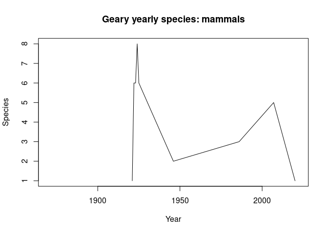

GBIF Draft Partitioning Script
================

The following is a test script for visualizing data extracted from GBIF
for different sites. It will be modified to suit our needs later.

``` r
# sample code for extracting Bunker locality information
# works from GBIF downloads
# this is set up for presence/absence based on decadel windows

library(tidyverse)
```

    ## ── Attaching packages ─────────────────────────────────────── tidyverse 1.3.1 ──

    ## ✔ ggplot2 3.3.6     ✔ purrr   0.3.4
    ## ✔ tibble  3.1.7     ✔ dplyr   1.0.9
    ## ✔ tidyr   1.2.0     ✔ stringr 1.4.0
    ## ✔ readr   2.1.2     ✔ forcats 0.5.1

    ## ── Conflicts ────────────────────────────────────────── tidyverse_conflicts() ──
    ## ✖ dplyr::filter() masks stats::filter()
    ## ✖ dplyr::lag()    masks stats::lag()

``` r
library(terra)
```

    ## terra 1.5.21

    ## 
    ## Attaching package: 'terra'

    ## The following object is masked from 'package:dplyr':
    ## 
    ##     src

    ## The following object is masked from 'package:tidyr':
    ## 
    ##     extract

    ## The following object is masked from 'package:ggplot2':
    ## 
    ##     arrow

``` r
# declare gbif download file
# note that csv 
# but actually tab delim
ks_raw=read.delim("~/Dropbox/Manuscripts/KS_Resurvey/0276914-210914110416597.csv",sep="\t")
```

    ## Warning in scan(file = file, what = what, sep = sep, quote = quote, dec = dec, :
    ## EOF within quoted string

``` r
n1=nrow(ks_raw)

# limit to herps, birds, mammals
ks=ks_raw%>%filter(class=='Reptilia'| # reptiles
                 class=='Amphibia'| # amphibians
                 class=='Mammalia'| # mammals
                 class=='Aves')%>% # birds
  # restrict to fewer columns
  select(class,genus,species,infraspecificEpithet,
         locality,decimalLongitude,decimalLatitude,
         coordinateUncertaintyInMeters,
         day,month,year,basisOfRecord,
         institutionCode,catalogNumber)%>%
  # remove records with bad accuracy of locality
  # set to 10 km
  filter(coordinateUncertaintyInMeters<10000|
           is.na(coordinateUncertaintyInMeters))

# free up space!
rm(ks_raw)

n2=nrow(ks)

# difference in rows?
n1-n2
```

    ## [1] 897816

``` r
# we want to get presence absence from within certain areas. 
# Firstly, we can restrict all data to Kansas and remove extraneous columns.

# load localities

# either load shapefiles of area or buffers around area
# for this example, buffers of 5 km around each
# note that some sites are not points but lines!
# Notable, line from Neosho Falls (town) to Goss' home

locs=vect("~/Dropbox/Manuscripts/KS_Resurvey/Bunker_20220503.shp")

ks_map=vect("~/Dropbox/Manuscripts/KS_Resurvey/ks_outline.gpkg")

# vizualize
plot(ks_map)
plot(locs,add=T,col="red",pch=19)
```

<!-- -->

``` r
# create buffers around points
# buffer unit is meters

loc_buff=buffer(locs,width=10000)

# too big to write as coords all at once...
# R can't handle it

# reduce to coordinates within the area first!
ks_coords=ks%>%as.data.frame%>%
  select(decimalLongitude,decimalLatitude)%>%
  unique
ks_coords2=ks_coords

crs_opt=crs(ks_map)
ks_coords$decimalLatitude=as.numeric(ks_coords$decimalLatitude)
```

    ## Warning: NAs introduced by coercion

``` r
ks_coords$decimalLongitude=as.numeric(ks_coords$decimalLongitude)

ks_coords=ks_coords%>%
  vect(geom=c("decimalLongitude","decimalLatitude"),crs="epsg:4326")

ks_coords$StudySite=NA

for(i in 1:length(loc_buff)){
  index=which(relate(ks_coords,loc_buff[i],"within"))
  ks_coords$StudySite[index]=loc_buff$Locality[i]
}

# visualize unique locations
plot(ks_map)
plot(ks_coords,add=T,pch=".")
plot(loc_buff,add=T)
plot(ks_coords[!is.na(ks_coords$StudySite)],add=T,col="red")
```

<!-- -->

``` r
ks_coords3=ks_coords%>%
  as.data.frame

ks_coords_bound=
  cbind(ks_coords2,ks_coords3)%>%
  filter(!is.na(StudySite))

# filter large data frame to those in smaller data frame
ks_survey=inner_join(ks_coords_bound,ks,by=c('decimalLongitude','decimalLatitude'))
# free up data
rm(ks)
rm(ks_coords_bound)
rm(ks_coords)
rm(ks_coords2)
rm(ks_coords3)

# get basic statistics

loc_names=unique(ks_survey$StudySite)
```

``` r
for(i in 1:length(loc_names)){
  # get locality
  loc_x=loc_names[i]
  # get locality information
  ks_x=ks_survey%>%filter(StudySite==loc_x)
  # split phylogroups
  birds=ks_x%>%filter(class=='Aves')
  reptiles=ks_x%>%filter(class=='Reptilia')
  amphibs=ks_x%>%filter(class=='Amphibia')
  mammals=ks_x%>%filter(class=='Mammalia')
  
  # birds
  dat=birds
  dat_tots=dat%>%
    select(year,species)%>%
    unique%>%
    aggregate(species~year,length)
  plot(dat_tots$year,dat_tots$species,
       type='l',xlab='Year',ylab='Species',
       main=paste0(loc_x,' yearly species: birds'),
       xlim=c(1870,2022))
  
  # reptiles
  dat=reptiles
  if(nrow(dat>0)){
    dat_tots=dat%>%
      select(year,species)%>%
      unique%>%
      aggregate(species~year,length)
    plot(dat_tots$year,dat_tots$species,
         type='l',xlab='Year',ylab='Species',
         main=paste0(loc_x,' yearly species: reptiles'),
         xlim=c(1870,2022))
  }
  
  # amphibians
  dat=amphibs
  if(nrow(dat>0)){
  dat_tots=dat%>%
    select(year,species)%>%
    unique%>%
    aggregate(species~year,length)
  plot(dat_tots$year,dat_tots$species,
       type='l',xlab='Year',ylab='Species',
       main=paste0(loc_x,' yearly species: amphibians'),
       xlim=c(1870,2022))
  }
  
  # mammals
  if(nrow(dat>0)){
    dat=mammals
  dat_tots=dat%>%
    select(year,species)%>%
    unique%>%
    aggregate(species~year,length)
  plot(dat_tots$year,dat_tots$species,
       type='l',xlab='Year',ylab='Species',
       main=paste0(loc_x,' yearly species: mammals'),
       xlim=c(1870,2022))
  }
}
```

<!-- --><!-- --><!-- --><!-- --><!-- --><!-- --><!-- --><!-- --><!-- --><!-- --><!-- --><!-- --><!-- --><!-- --><!-- --><!-- --><!-- --><!-- --><!-- --><!-- --><!-- --><!-- --><!-- --><!-- --><!-- --><!-- --><!-- --><!-- --><!-- --><!-- --><!-- --><!-- --><!-- --><!-- --><!-- --><!-- --><!-- --><!-- --><!-- --><!-- --><!-- --><!-- --><!-- --><!-- --><!-- --><!-- --><!-- --><!-- --><!-- --><!-- --><!-- --><!-- --><!-- --><!-- --><!-- --><!-- --><!-- --><!-- --><!-- --><!-- --><!-- --><!-- --><!-- --><!-- --><!-- --><!-- --><!-- --><!-- --><!-- --><!-- --><!-- --><!-- --><!-- --><!-- --><!-- --><!-- --><!-- --><!-- --><!-- --><!-- -->
